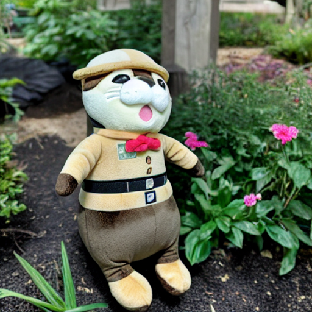

# Make your own emoji 🤩

## Introduction 🐣
This project was conducted as part of a competition organized by the YAI Conference (October 2024 - December 2024). \
The goal of this project is to create short video-like emojis personalized to items or beings that individuals cherish, such as pets or belongings. \
With just 3-5 photos, users can generate emojis tailored to their preferences! \
The model is designed to be user-friendly, allowing users not only to add descriptive text but also to assign their own trajectories, enabling greater control and creativity.

## Model Architecture 🔥
This model leverages the DreamBooth framework to fine-tune and store the user's photos with a unique identifier. \
Once fine-tuned, the model allows users to input a text prompt, which generates an image that passes through an image-to-video model. \
The generated output can be further enhanced by allowing users to directly provide trajectories or motion brushes, 
enabling the creation of fully controllable videos.

## Results 🐥

<table align="center">
  <tr>
    <td align="center">
      
      <br />
    </td>
    </td>
    <td align="center">
      
      <br />
    </td>
  </tr>
  <tr>
    <td colspan="3" align="center" style="border: none;">
      A photo of [V] cat resting on a checkered blanket outdoors.
    </td>
  </tr>
</table>

<table align="center">
  <tr>
    <td align="center">
      
      <br />
    </td>
    </td>
    <td align="center">
      
      <br />
    </td>
  </tr>
  <tr>
    <td colspan="3" align="center" style="border: none;">
      A photo of [V] otter plushie standing in a garden surrounded by flowers.
    </td>
  </tr>
</table>

<table align="center">
  <tr>
    <td align="center">
      
      <br />
    </td>
    </td>
    <td align="center">
      
      <br />
    </td>
  </tr>
  <tr>
    <td colspan="3" align="center" style="border: none;">
      A photo of [V] fox plushie standing against the tree in the forest.
    </td>
  </tr>
</table>

## Environment Setup

`pip install -r requirements.txt`

## Download checkpoints

1. Download the pretrained checkpoints of [SVD_xt](https://huggingface.co/stabilityai/stable-video-diffusion-img2vid-xt-1-1) from huggingface to `./ckpts`.

2. Download the checkpint of [MOFA-Adapter](https://huggingface.co/MyNiuuu/MOFA-Video-Traj) from huggingface to `./ckpts`.

The final structure of checkpoints should be:

```text
./ckpts/
|-- controlnet
|   |-- config.json
|   `-- diffusion_pytorch_model.safetensors
|-- stable-video-diffusion-img2vid-xt-1-1
|   |-- feature_extractor
|       |-- ...
|   |-- image_encoder
|       |-- ...
|   |-- scheduler
|       |-- ...
|   |-- unet
|       |-- ...
|   |-- vae
|       |-- ...
|   |-- svd_xt_1_1.safetensors
|   `-- model_index.json
```

## Run Gradio Demo

`python run_gradio.py`

Please refer to the instructions on the gradio interface during the training and inference process.


## Credits
This repository builds upon the following projects, which provided the foundation for the implementation:

- [MOFA-Video](https://github.com/MyNiuuu/MOFA-Video/tree/main): Controllable Image Animation via Generative Motion Field Adaptions in Frozen Image-to-Video Diffusion Model.
- [Diffusers](https://github.com/huggingface/diffusers): A library for state-of-the-art diffusion models in PyTorch.


